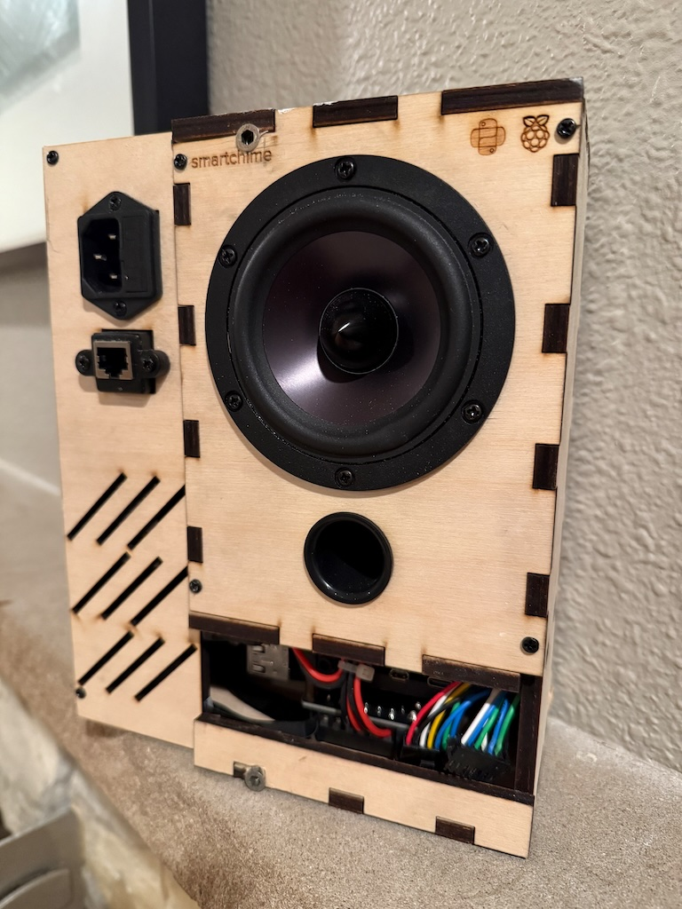

# smartchime
## a doorbell, written in Python

**..wait, a doorbell in Python?**
why, yes, yes indeed! Why, you ask? Well, two problems presented themselves at once (and then a third opportunity, later!):

- I had a hole in my wall, thanks to a very old, very tired NuTone intercom head flush-mounted right next to my front door. I am exceedingly grateful for its many years of service (never a missed Winchester chime since I moved in and presumably, dating all the way back to when the house was built in 1967). It even played along for a few years wired up to a doorbell camera. 

- I needed to learn and practice some more practical(-ish) Python. As a bonus, this particular project presented an opportunity to integrate simpler hardware devices, and interact with them at a slightly lower level - with the ultimate goal being to create a cohesive, useful thing out of several distinct components.

- But then, _vibe coding_ became a thing. I revisited this project after 4 or so years, and asked Claude 3.5 Sonnet to rewrite it from scratch. The experience was very good learning. After some iteration and testing, the result has been released as v2.0.0, and I finally took the time to write down how I built it all.

## Highlights

**It's a doorbell:** feed it any sound file, and it'll happily play when someone's at the door. 

**Camera feed:** Video clips or RTSP streams are played via a 1080p AMOLED display, either on demand (via encoder button), or on doorbell/motion event.

**Event-based triggers:** support is written in for motion, doorbell press, and rotary encoders/switches providing various functions. Event delivery is expected via an MQTT broker, so the chime integrates very well with Home Assistant.

**Customizeable messages:** A small OLED display is always on and able to display various widgets, including a scrolling message string delivered via MQTT. This way, any data available to Home Assistant (temperatures, sensors, calendar events, holidays, birthdays, mail delivery, you name it!) is something that can be displayed.

## Making the frame and front fascia
SVG files are available in this repo for laser, or maybe even 3D prints?

I used Ponoko and had them cut the frame using 0.25" balsa plywood - back in 2022 before I had a 3D printer, this was a solution I can't complain much about. If 3D printing, you'll need to maintain the X/Y scale of the drawings and then scale Z of course to 0.25". If this is going in your wall, ABS/ASA or PC may be more appropriate materials, and I'd probably bias the infill density higher for both strength and acoustics.

Here is what the bulk of the device looks like after sitting in my wall for about 3 years:



For the fascia, I had Ponoko cut 2.50mm 304 stainless steel. This is meant to fit the existing NuTone outer facade, and provide mounting points for the displays and controls. The inner metal frame is covered with black speaker grille cloth. 

When assembled, here's what we get!

> TODO: image

## Hardware requirements
- Raspberry Pi 4B - 4GB or 8GB
  - I do not know how well this will work on the Pi 5, or other SBCs.
- [HifiBerry Amp2](https://www.hifiberry.com/shop/boards/amp2/)
- Dayton Audio RS100-4, 4" 4-Ohm full range driver
- [Waveshare 5.5" 1080p AMOLED](https://www.waveshare.com/wiki/5.5inch_HDMI_AMOLED)
- [Adafruit Rotary Encoder](https://www.adafruit.com/product/377)
- [Waveshare 2.23" 128x32 OLED](https://www.waveshare.com/wiki/2.23inch_OLED_HAT)

## Tested on
- DietPi 9.12

## Software setup
In `dietpi-config`:
- Set locale, network, wifi according to your environment.
- Enable the `vc4-fkms-v3d` driver (FKMS is necessary for vcgencmd to work).
- Set the HDMI-A-1 display to 1080x1920@60. Rotate 270 degrees.
- In audio options:
  - allow ALSA to be installed.
  - select the `hifiberry-dacplus` sound card.
- In advanced options:
  - Enable SPI.

Package installation:
```bash
# packages
sudo apt update
sudo apt install -y \
    python3-pip \
    python3-dev \
    python3.11-venv \
    build-essential \
    gcc \
    libasound2-dev \
    vlc \
    git 
# enable systemd-logind (dbus)
sudo systemctl unmask systemd-logind
# grant various hardware access to the dietpi user
sudo usermod -aG video,render,audio,gpio,spi dietpi
# install shairport-sync
sudo dietpi-software install 37
```
Shairport-sync configuration:
- In `/usr/local/etc/shairport-sync.conf`:
  - Adjust the ALSA mixer name, if required.
  - Enable metadata

We'll need to restore some `udev` rules in order for `vcgencmd` to function as a non-root user, borrowing from Raspberry Pi OS - create a file called `/etc/udev/rules.d/10-local-rpi.rules`, with this content:

```
KERNEL=="vchiq", GROUP="video", MODE="0660"
KERNEL=="vcsm-cma", GROUP="video", MODE="0660"
KERNEL=="vcio", GROUP="video", MODE="0660"
```

At this point, you should be ready to clone the repository.
`cp config.example.yaml config.yaml`, and then customize `config.yaml` to your liking.

It may be best to create a venv given the various requirements Smartchime has:

```bash
python3 -m venv .venv
source .venv/bin/activate
pip3 install -r requirements.txt
```

Finally, you may wish to start the Smartchime code on boot. Here's a suggested systemd service (make sure to adjust paths as necessary):

```
[Unit]
Description=Smartchime
After=network.target

[Service]
type=exec
WorkingDirectory=/home/dietpi/smartchime
ExecStart=/home/dietpi/smartchime/.venv/bin/python /home/dietpi/smartchime/main.py
Restart=always
User=dietpi
Group=dietpi

[Install]
WantedBy=multi-user.target
```

## Acknowledgments

- Shairport Sync for AirPlay support
  - https://dietpi.com/docs/software/media/#shairport-sync
- https://github.com/DanielHartUK/Dot-Matrix-Typeface
- luma.oled for OLED display drivers
- RPi.GPIO for hardware interface
- All other open source contributors