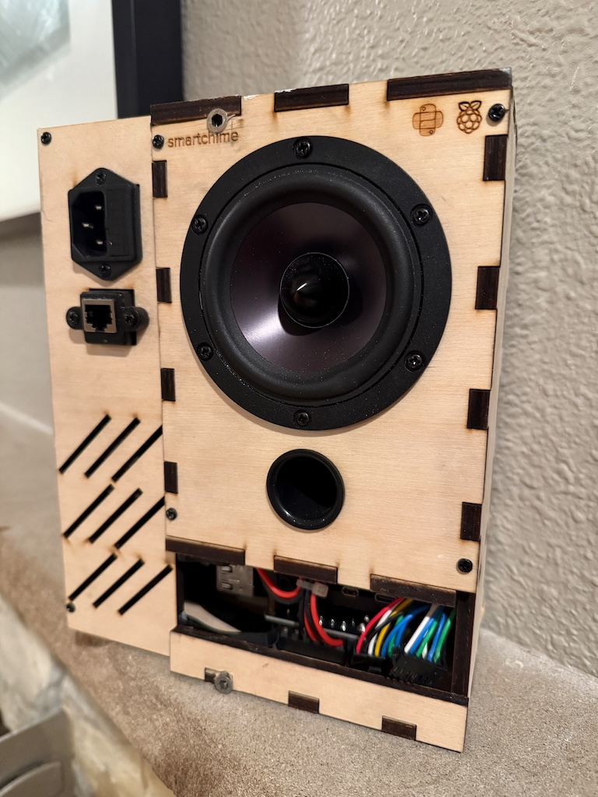

# smartchime
## a doorbell, written in Python

**..wait, a doorbell in Python?**
why, yes, yes indeed! Why, you ask? Well, two problems presented themselves at once (and then a third opportunity, later!):

- I had a hole in my wall, thanks to a very old, very tired NuTone intercom head flush-mounted right next to my front door. I am exceedingly grateful for its many years of service (never a missed Winchester chime since I moved in and presumably, dating all the way back to when the house was built in 1967). It even played along for a few years wired up to a doorbell camera. 

- I needed to learn and practice some more practical(-ish) Python. As a bonus, this particular project presented an opportunity to integrate simpler hardware devices, and interact with them at a slightly lower level - with the ultimate goal being to create a cohesive, useful thing out of several distinct components.

- But then, _vibe coding_ became a thing. I revisited this project after 4 or so years, and asked Claude 3.5 Sonnet to rewrite it from scratch. The experience was very good learning. After some iteration and testing, the result has been released as v2.0.0, and I finally took the time to write down how I built it all.

## Highlights

**It's a doorbell:** feed it any sound file, and it'll happily play when someone's at the door. 

**Camera feed:** Video clips or RTSP streams are played via a 1080p AMOLED display, either on demand (via encoder button), or on doorbell/motion event.

**Event-based triggers:** support is written in for motion, doorbell press, and rotary encoders/switches providing various functions. Event delivery is expected via an MQTT broker, so the chime integrates very well with Home Assistant.

**Customizeable messages:** A small OLED display is always on and able to display various widgets, including a scrolling message string delivered via MQTT. This way, any data available to Home Assistant (temperatures, sensors, calendar events, holidays, birthdays, mail delivery, you name it!) is something that can be displayed.

## Making the frame and front fascia
SVG files are available in this repo for laser, or maybe even 3D prints?

I used Ponoko and had them cut the frame using 0.25" balsa plywood - back in 2022 before I had a 3D printer, this was a solution I can't complain much about. If 3D printing, you'll need to maintain the X/Y scale of the drawings and then scale Z of course to 0.25". If this is going in your wall, ABS/ASA or PC may be more appropriate materials, and I'd probably bias the infill density higher for both strength and acoustics.

Here is what the bulk of the device looks like after sitting in my wall for about 3 years:



For the fascia, I had Ponoko cut 2.50mm 304 stainless steel. This is meant to fit the existing NuTone outer facade, and provide mounting points for the displays and controls. The inner metal frame is covered with black speaker grille cloth. 

When assembled, here's what we get!

> TODO: image

## Hardware requirements
- Raspberry Pi 4B - 4GB or 8GB
  - I do not know how well this will work on the Pi 5, or other SBCs.
- [HifiBerry Amp2](https://www.hifiberry.com/shop/boards/amp2/)
- Dayton Audio RS100-4, 4" 4-Ohm full range driver
- [Waveshare 5.5" 1080p AMOLED](https://www.waveshare.com/wiki/5.5inch_HDMI_AMOLED)
- [Adafruit Rotary Encoder](https://www.adafruit.com/product/377)
- [Waveshare 2.23" 128x32 OLED](https://www.waveshare.com/wiki/2.23inch_OLED_HAT)

## Tested on
- DietPi 10.x (Debian Trixie) on Raspberry Pi 4B

## Software setup

Most of the setup is automated via two files placed on the SD card before first boot. After DietPi completes its initial configuration, a post-boot script handles hardware setup, software installation, and service creation.

### Automated setup (recommended)

1. **Flash** a [DietPi image](https://dietpi.com/#download) for Raspberry Pi to your SD card.

2. **Copy two files** from this repository to the SD card's boot partition:
   - `dietpi.txt` — replaces the default DietPi automation config
   - `Automation_Custom_Script.sh` — runs after DietPi's first-boot setup

   If using WiFi, also edit `dietpi-wifi.txt` on the boot partition with your credentials.

3. **Boot the Pi.** DietPi will run unattended: applying system settings, installing packages (including shairport-sync with AirPlay 2 support), then executing the custom script.

   The custom script handles:
   - Enabling SPI and the `vc4-fkms-v3d` (FKMS) display driver
   - Configuring the HDMI output for the Waveshare 5.5" AMOLED (1080×1920@60Hz, rotated 270°)
   - Enabling RPi video codecs
   - Adding the `dietpi` user to hardware groups (`video`, `render`, `audio`, `gpio`, `spi`)
   - Creating udev rules for `vcgencmd` access
   - Configuring shairport-sync (ALSA mixer → `Digital`, metadata pipe enabled)
   - Cloning this repository to `/home/dietpi/smartchime`
   - Creating a Python venv and installing dependencies (`pip install ".[hw]"`)
   - Copying `config.example.yaml` → `config.yaml`
   - Creating a `smartchime.service` systemd unit (disabled — you enable it after configuring)

   Script output is logged to `/var/tmp/dietpi/logs/dietpi-automation_custom_script.log`.

4. **Reboot** to apply hardware changes (SPI, display driver, codecs):
   ```bash
   sudo reboot
   ```

5. **Verify the display.** After reboot, the AMOLED should show output at the correct resolution and rotation. If it doesn't, fix it manually:
   ```bash
   sudo dietpi-config
   ```
   Navigate to *Display Options* → set `vc4-fkms-v3d` driver, 1080×1920@60 resolution, 270° rotation.

6. **Edit `config.yaml`** with your environment-specific settings:
   ```bash
   nano /home/dietpi/smartchime/config.yaml
   ```
   At minimum, configure:
   - `mqtt.broker` — your MQTT broker address
   - `mqtt.username` / `mqtt.password` — if your broker requires authentication
   - `audio.directory` — path to your WAV sound files
   - `video.default_stream` — your camera's RTSP/HTTP stream URL

7. **Verify shairport-sync** — the script sets the ALSA mixer control to `Digital` (matching the HifiBerry Amp2). If your setup uses a different mixer control, adjust `/usr/local/etc/shairport-sync.conf`. The original config is backed up as `shairport-sync.conf.bak`.

8. **Enable and start the service:**
   ```bash
   sudo systemctl enable --now smartchime.service
   ```

### Manual setup

If you prefer to set things up by hand (or on a non-DietPi system), here are the individual steps:

<details>
<summary>Click to expand manual setup instructions</summary>

**System configuration** (via `dietpi-config` or equivalent):
- Enable the `vc4-fkms-v3d` driver (FKMS is required for `vcgencmd`).
- Set HDMI output to 1080×1920@60Hz, rotated 270°.
- Select the `hifiberry-dacplus` sound card.
- Enable SPI.

**Package installation:**
```bash
sudo apt update
sudo apt install -y \
    python3-pip \
    python3-dev \
    python3.13-venv \
    build-essential \
    gcc \
    libasound2-dev \
    liblgpio-dev \
    vlc \
    git
sudo systemctl unmask systemd-logind
sudo usermod -aG video,render,audio,gpio,spi dietpi
```

**Install shairport-sync** (on DietPi):
```bash
sudo dietpi-software install 37
```
Then edit `/usr/local/etc/shairport-sync.conf`:
- Set `mixer_control_name` to `"Digital"` (or your ALSA mixer control)
- Enable metadata: set `enabled` to `"yes"` in the `metadata` section
- Verify `pipe_name` is `/tmp/shairport-sync-metadata`

**udev rules** — create `/etc/udev/rules.d/10-local-rpi.rules`:
```
KERNEL=="vchiq", GROUP="video", MODE="0660"
KERNEL=="vcsm-cma", GROUP="video", MODE="0660"
KERNEL=="vcio", GROUP="video", MODE="0660"
```

**Clone and install:**
```bash
git clone https://github.com/jbruns/smartchime.git /home/dietpi/smartchime
cd /home/dietpi/smartchime
python3 -m venv .venv
source .venv/bin/activate
pip install ".[hw]"
cp config.example.yaml config.yaml
```

**systemd service** — create `/etc/systemd/system/smartchime.service`:
```ini
[Unit]
Description=Smartchime
After=network.target

[Service]
Type=exec
WorkingDirectory=/home/dietpi/smartchime
ExecStart=/home/dietpi/smartchime/.venv/bin/python -m smartchime
Restart=always
User=dietpi
Group=dietpi

[Install]
WantedBy=multi-user.target
```

Then: `sudo systemctl daemon-reload`

</details>

### Development setup

For local development (linting, testing — no hardware packages):

```bash
pip install -e ".[dev]"
```

For development on the Pi (with hardware packages):

```bash
pip install -e ".[dev,hw]"
```

## Integrating with Home Assistant

See the `examples/` directory for starter automations, which will publish the right MQTT events for Smartchime to react to.

Note that you can (and probably should) control how long motion or doorbell events are treated as 'active' in Home Assistant, based on your specific needs. This means that, for example, if you only want the doorbell to be "rung" a maximum of every 10 seconds, instruct Home Assistant to wait until your doorbell sensor is out of the "ring" state for 10 seconds before setting Smartchime's doorbell event to 'false'.

For the motion and doorbell events, a JSON payload is expected:

```json
{
  "active": false,
  "timestamp": "{{ now().isoformat() }}",
  "video_url": "rtsp://camera/stream?user=abc&resolution=xyz"
}
```

| Parameter | Type | Purpose |
|-----------|------|---------|
| active    | bool | Whether the motion or doorbell event should be treated as 'active'. |
| timestamp | timedate | Generally, should be the template value `{{ now().isoformat() }}`, meaning the current time in ISO format. |
| video_url | url | pointer to a relevant video clip, if one is available. If not specified, the default url specified in `config.yaml` will be used. |

For the OLED message, either a raw non-JSON payload can be sent, or if you prefer:

```json
{
  "text": "hello world"
}
```

## Acknowledgments

- Shairport Sync for AirPlay support
  - https://dietpi.com/docs/software/media/#shairport-sync
- https://github.com/DanielHartUK/Dot-Matrix-Typeface
- luma.oled for OLED display drivers
- RPi.GPIO for hardware interface
- All other open source contributors