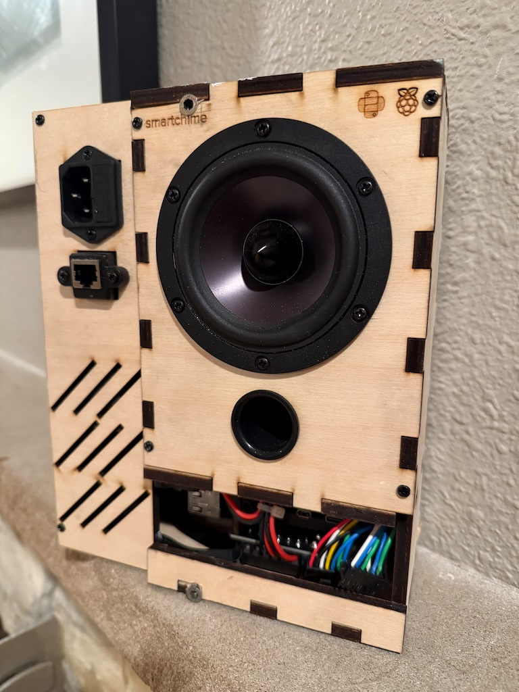

# smartchime
## a doorbell, written in Python

**..wait, a doorbell in Python?**
why, yes, yes indeed! Why, you ask? Well, two problems presented themselves at once (and then a third opportunity, later!):

- I had a hole in my wall, thanks to a very old, very tired NuTone intercom head flush-mounted right next to my front door. I am exceedingly grateful for its many years of service (never a missed Winchester chime since I moved in and presumably, dating all the way back to when the house was built in 1967). It even played along for a few years wired up to a doorbell camera. 

- I needed to learn and practice some more practical(-ish) Python. As a bonus, this particular project presented an opportunity to integrate simpler hardware devices, and interact with them at a slightly lower level - with the ultimate goal being to create a cohesive, useful thing out of several distinct components.

- But then, _vibe coding_ became a thing. I revisited this project after 4 or so years, and asked Claude 3.5 Sonnet to rewrite it from scratch. The experience was very good learning. After some iteration and testing, the result has been released as v2.0.0, and I finally took the time to write down how I built it all.

## Highlights

**It's a doorbell:** feed it any sound file, and it'll happily play when someone's at the door. 

**Camera feed:** A 1080p AMOLED display runs in Chromium kiosk mode, managed by DietPi's X11 autostart — no Python-side display management needed.

**Event-based triggers:** support is written in for doorbell press and rotary encoders/switches providing various functions. Event delivery is expected via an MQTT broker, so the chime integrates very well with Home Assistant.

**Customizeable messages:** A small OLED display is always on and able to display various widgets, including a scrolling message string delivered via MQTT. This way, any data available to Home Assistant (temperatures, sensors, calendar events, holidays, birthdays, mail delivery, you name it!) is something that can be displayed.

## Making the frame and front fascia
SVG files are available in this repo for laser, or maybe even 3D prints?

I used Ponoko and had them cut the frame using 0.25" balsa plywood - back in 2022 before I had a 3D printer, this was a solution I can't complain much about. If 3D printing, you'll need to maintain the X/Y scale of the drawings and then scale Z of course to 0.25". If this is going in your wall, ABS/ASA or PC may be more appropriate materials, and I'd probably bias the infill density higher for both strength and acoustics.

Here is what the bulk of the device looks like after sitting in my wall for about 3 years:



For the fascia, I had Ponoko cut 2.50mm 304 stainless steel. This is meant to fit the existing NuTone outer facade, and provide mounting points for the displays and controls. The inner metal frame is covered with black speaker grille cloth. 

When assembled, here's what we get!

> TODO: image

## Hardware requirements
- Raspberry Pi 4B - 4GB or 8GB
  - I do not know how well this will work on the Pi 5, or other SBCs.
- [HifiBerry Amp2](https://www.hifiberry.com/shop/boards/amp2/)
- Dayton Audio RS100-4, 4" 4-Ohm full range driver
- [Waveshare 5.5" 1080p AMOLED](https://www.waveshare.com/wiki/5.5inch_HDMI_AMOLED)
- [Adafruit Rotary Encoder](https://www.adafruit.com/product/377)
- [Waveshare 2.23" 128x32 OLED](https://www.waveshare.com/wiki/2.23inch_OLED_HAT)

## Tested on
- DietPi 10.x (Debian Trixie) on Raspberry Pi 4B

## Software setup

Most of the setup is automated via two files placed on the SD card before first boot. After DietPi completes its initial configuration, a post-boot script handles hardware setup, software installation, and service creation.

### Automated setup (recommended)

1. **Flash** a [DietPi image](https://dietpi.com/#download) for Raspberry Pi to your SD card.

2. **Copy two files** from this repository to the SD card's boot partition:
   - `dietpi.txt` — replaces the default DietPi automation config
   - `Automation_Custom_Script.sh` — runs after DietPi's first-boot setup

   If using WiFi, also edit `dietpi-wifi.txt` on the boot partition with your credentials.

3. **Boot the Pi.** DietPi will run unattended: applying system settings, installing packages (including shairport-sync with AirPlay 2 support), then executing the custom script.

   The custom script handles:
   - Enabling SPI and the `vc4-kms-v3d` (KMS) display driver, with HDMI audio off (`noaudio`) so it can't compete with the HifiBerry
   - Letting KMS take the Waveshare 5.5" AMOLED's mode (1080×1920@60Hz) from its EDID (`disable_fw_kms_setup=1`), and rotating the boot console 270°
   - Configuring X11 display and touch rotation for the Waveshare AMOLED, and hiding the mouse cursor
   - Turning off X11 screen blanking and DPMS: Home Assistant decides when the Panel sleeps ([ADR 0001](docs/adr/0001-home-assistant-owns-panel-sleep.md))
   - Adding the `dietpi` user to hardware groups (`video`, `render`, `audio`, `gpio`, `spi`)
   - Configuring shairport-sync (ALSA mixer → `Digital`, metadata pipe enabled)
   - Cloning this repository to `/home/dietpi/smartchime`
   - Copying `config.example.yaml` → `config.yaml`
   - Running [`smartchime-update`](#updating), which installs uv, deploys the latest release and creates a `smartchime.service` systemd unit (disabled — you enable it after configuring)

   Script output is logged to `/var/tmp/dietpi/logs/dietpi-automation_custom_script.log`.

4. **Reboot** to apply hardware changes (SPI, display driver):
   ```bash
   sudo reboot
   ```

5. **Verify the display.** After reboot, Chromium should launch automatically in kiosk mode on the AMOLED in landscape, with no mouse cursor. The active mode should be the EDID's `1080x1920` at 137.52 MHz, rotated `right`:
   ```bash
   DISPLAY=:0 xrandr --verbose
   ```
   Legacy `hdmi_*` options in `config.txt` (`hdmi_group`, `hdmi_timings`, `config_hdmi_boost`, …) have no effect under KMS; don't add them.

6. **Edit `config.yaml`** with your environment-specific settings:
   ```bash
   nano /home/dietpi/smartchime/config.yaml
   ```
   At minimum, configure:
   - `mqtt.broker` — your MQTT broker address
   - `mqtt.username` / `mqtt.password` — if your broker requires authentication
   - `audio.directory` — path to your WAV sound files

7. **Verify shairport-sync** — the script sets the ALSA mixer control to `Digital` (matching the HifiBerry Amp2). If your setup uses a different mixer control, adjust `/usr/local/etc/shairport-sync.conf`. The original config is backed up as `shairport-sync.conf.bak`.

8. **Enable and start the service:**
   ```bash
   sudo systemctl enable --now smartchime.service
   ```

### Updating

The Pi runs only tagged releases. To update, run:

```bash
sudo smartchime-update
```

It checks out the latest `vX.Y.Z` tag, syncs the venv with uv and restarts `smartchime.service`. If the service isn't still up 30 seconds later, it rolls back to the previous release (never below `v2.5.0`, the first uv release) and exits non-zero with the reason. If you're already on the latest release, it doesn't restart anything.

Every run also converges the host, so it's safe to repeat:
- installs uv to `~dietpi/.local/bin` (or runs `uv self update`), and replaces an old pip venv with a uv one
- holds `linux-image-rpi-v8`, `raspi-firmware` and `rpi-eeprom`, and sets `/boot/dietpi.txt` to apply APT upgrades automatically and only notify of DietPi updates ([ADR 0003](docs/adr/0003-os-updates-apt-auto-applies-kernel-firmware-held.md))
- installs or updates the `smartchime.service` unit, and links `/usr/local/bin/smartchime-update`

To apply the held kernel/firmware updates, run `sudo smartchime-update --os`. It tells you whether a reboot is required but doesn't reboot.

A chime set up before `smartchime-update` existed migrates by running it once from the repository:

```bash
git -C ~/smartchime fetch origin && git -C ~/smartchime show origin/main:scripts/smartchime-update | sudo bash
```

### Manual setup

If you prefer to set things up by hand (or on a non-DietPi system), here are the individual steps:

<details>
<summary>Click to expand manual setup instructions</summary>

**System configuration** (via `dietpi-config` or equivalent):
- Enable the `vc4-kms-v3d` driver.
- Set HDMI output to 1080×1920@60Hz, rotated 270°.
- Select the `hifiberry-dacplus` sound card.
- Enable SPI.

**Package installation:**
```bash
sudo apt update
sudo apt install -y \
    python3-dev \
    build-essential \
    gcc \
    libasound2-dev \
    liblgpio-dev \
    curl \
    git
curl -LsSf https://astral.sh/uv/install.sh | sh   # installs uv to ~/.local/bin
sudo usermod -aG video,render,audio,gpio,spi dietpi
```

**Install shairport-sync** (on DietPi):
```bash
sudo dietpi-software install 37
```
Then edit `/usr/local/etc/shairport-sync.conf`:
- Set `mixer_control_name` to `"Digital"` (or your ALSA mixer control)
- Enable metadata: set `enabled` to `"yes"` in the `metadata` section
- Verify `pipe_name` is `/tmp/shairport-sync-metadata`

**udev rules** — create `/etc/udev/rules.d/10-local-rpi.rules`:
```
KERNEL=="vchiq", GROUP="video", MODE="0660"
KERNEL=="vcsm-cma", GROUP="video", MODE="0660"
KERNEL=="vcio", GROUP="video", MODE="0660"
```

**Clone and install:**
```bash
git clone https://github.com/jbruns/smartchime.git /home/dietpi/smartchime
cd /home/dietpi/smartchime
uv sync --frozen --extra hw --no-dev --python /usr/bin/python3 --no-python-downloads
cp config.example.yaml config.yaml
```

**systemd service** — create `/etc/systemd/system/smartchime.service` (on DietPi, `sudo scripts/smartchime-update` does this, and the uv install and sync above):
```ini
[Unit]
Description=Smartchime
Wants=network-online.target
After=network-online.target

[Service]
Type=exec
WorkingDirectory=/home/dietpi/smartchime
ExecStart=/home/dietpi/smartchime/.venv/bin/python -m smartchime
Restart=always
User=dietpi
Group=dietpi

[Install]
WantedBy=multi-user.target
```

Then: `sudo systemctl daemon-reload`

</details>

### Development setup

Dependencies are locked in `uv.lock`. Install [uv](https://docs.astral.sh/uv/), then:

```bash
uv sync                  # local development: dev tools, no hardware packages
uv sync --extra hw       # developing on the Pi: add the hardware packages
uv run ruff check .
uv run pytest -m "not hardware"
```

Change dependencies in `pyproject.toml`, then run `uv lock` and commit both files. Renovate proposes updates weekly (`renovate.json`, extending the shared preset in [jbruns/ha-elevations](https://github.com/jbruns/ha-elevations/blob/main/docs/ci.md)).

### Releases

The version comes from the git tag (via `hatch-vcs`), so there is no version to bump. To release, tag and push:

```bash
git tag vX.Y.Z
git push origin vX.Y.Z
```

Then deploy it on the Pi with `sudo smartchime-update` (see [Updating](#updating)).

## Integrating with Home Assistant

Home Assistant drives Smartchime over MQTT. [`home_assistant/`](home_assistant/README.md) has everything it needs: blueprints for the Doorbell Event, the OLED State and the Panel Mode, the Panel dashboard for the AMOLED screen, and its theme.

The MQTT contract is in [`mqtt-schema/`](mqtt-schema/):

| Topic | Payload | Schema |
|-------|---------|--------|
| `smartchime/events/doorbell` | `{"active": bool, "timestamp": "ISO 8601"}`; an active event plays the Chime | [`event-state-doorbell-contract.schema.json`](mqtt-schema/event-state-doorbell-contract.schema.json) |
| `smartchime/display/oled` (retained) | The complete OLED State (version 2) | [`oled-v2-message-contract.schema.json`](mqtt-schema/oled-v2-message-contract.schema.json) |
| `smartchime/host/status` (retained, published by Smartchime) | The Host Status, on connect and hourly | [`host-status-contract.schema.json`](mqtt-schema/host-status-contract.schema.json) |

Smartchime also publishes [MQTT discovery](https://www.home-assistant.io/integrations/mqtt/#device-discovery-payload) (`homeassistant/device/smartchime/config`, retained) for one **Smartchime** device, whose software version is the running release, with three diagnostic entities from the Host Status: a DietPi `update` entity, an APT updates sensor, and a Reboot required binary sensor. The counts come from DietPi's own update checks, which `smartchime-update` enables; Smartchime never runs `apt` itself.

## Acknowledgments

- Shairport Sync for AirPlay support
  - https://dietpi.com/docs/software/media/#shairport-sync
- https://github.com/DanielHartUK/Dot-Matrix-Typeface
- luma.oled for OLED display drivers
- All other open source contributors